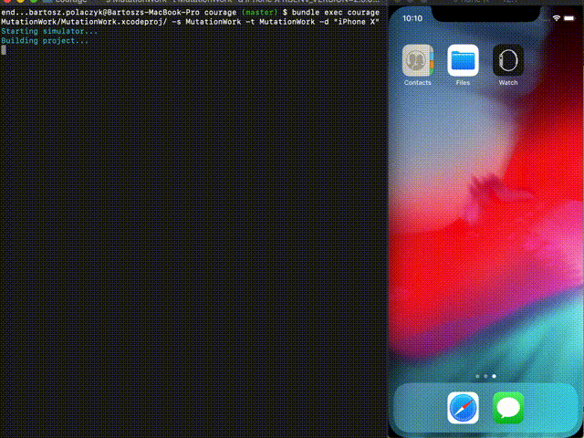

# courage

### Requirements:

* Xcode 10.1
* Bundler 16.1
* Ruby 2.5.0

### Demo



### Installation (WIP)

```bash
bundle install
bundle exec courage -s path/to/project.xcproj -s ShemeName -t ImplementationTarget -d "iPhone X"

# Optionally wor workspace
bundle exec courage -w path/to/project.xcworkspace -s MutationProject -t ImplementationTarget -d "iPhone X"
```

### Help

```bash

bundle exec courage -h

Usage: courage [OPTIONS] [PROJECT].xcodeproj
-p, --xcodeproj PROJ             Location of an .xcodeproj project
-w, --workspace WORKSPACE        Location of an .xcworkspace project
-l, --level RATIO                Set mutation ration (default to 100%)
-f, --files file1,file2,...      Exclusive mutation for specified file(s)
-x, --exclude file1,file2,...    Exclude specific file(s) in mutation
-s, --scheme SCEME               Project scheme to use
-t target1,target2,....,         Targets to mutate. Default to use all targets
--targets
-i, --sil-file file1             Simple sil file mutation (only for advanced users)
-d, --device device_name         Simulator device name to run tests
-v, --verbose                    Enabled verbose
-h, --help                       Prints this help
```
